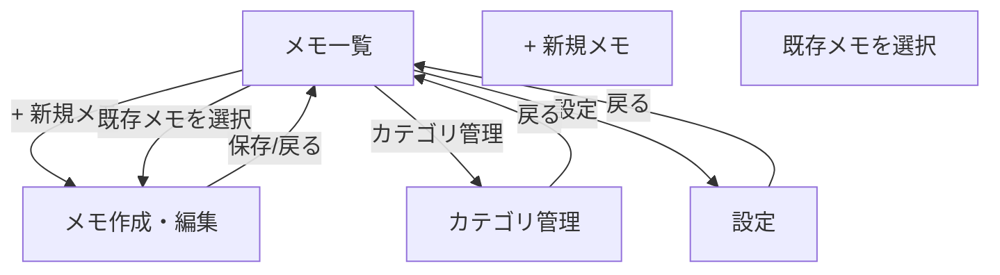

# Flutter × SQLite メモ帳アプリ 仕様書

---

## 1. 必要な主要機能リスト

1. **メモの作成**  
   ユーザーが新しいメモを作成できる機能。

2. **メモの編集**  
   既存のメモの内容やタイトルを編集できる機能。

3. **メモの削除**  
   不要なメモを削除できる機能。メモ一覧画面で各メモアイテムに削除ボタンを配置し、確認ダイアログを表示してから削除を実行する。

4. **メモの一覧表示**  
   保存されている全メモをリストで閲覧できる機能。

5. **メモの詳細表示**  
   選択したメモの内容を詳細画面で確認できる機能。

6. **メモの検索機能**  
   タイトル・内容でメモを検索できる機能。

7. **ソート・並び替え機能**  
   作成日や更新日でメモの並べ替え。

8. **カテゴリ管理機能**  
   メモごとにカテゴリを設定・管理できる機能。

9. **お気に入り管理**  
   よく使うメモをお気に入り登録できる機能。

10. **設定機能**  
    テーマ変更（明るい色/暗い色の切り替え）、データのエクスポート/インポート、アプリ情報などの基本設定。

---

## 2. メモの作成機能のユーザー操作説明

1. メイン画面（メモ一覧）右下の「+」アイコン（Floating Action Button）をタップ。
2. メモ作成画面へ遷移。
3. 画面上部のタイトル入力欄と画面中央から下部の内容入力欄に必要な内容を入力。
4. 必要に応じてカテゴリを選択し、お気に入りマークを付与。
5. 画面右上の「保存」ボタンをタップしてメモを保存。
6. 保存後、自動的にメモ一覧画面へ戻り、作成したメモがリストに表示される。

---

## 2.1. メモの削除機能のユーザー操作説明

1. メイン画面（メモ一覧）で削除したいメモアイテムの「削除🗑️」ボタンをタップ。
2. 確認ダイアログが表示される（「このメモを削除しますか？」）。
3. 「キャンセル」をタップすると削除を中止し、ダイアログが閉じる。
4. 「削除」をタップするとメモがデータベースから削除され、一覧からも消える。
5. 削除後、メモ一覧が自動的に更新される。

---

## 2.2. 設定画面のユーザー操作説明

### テーマ切り替え
1. メイン画面の右上「設定」アイコンをタップ。
2. 設定画面の「テーマ設定」セクションで「明るい色」または「暗い色」を選択。
3. 選択後、即座にアプリ全体のテーマが切り替わる。
4. 設定は自動保存され、次回起動時も維持される。

### データ管理
1. **エクスポート**：
   - 「データをエクスポート」ボタンをタップ。
   - メモとカテゴリデータがJSONファイルとして端末に保存される。
   - 保存完了のメッセージが表示される。

2. **インポート**：
   - 「データをインポート」ボタンをタップ。
   - ファイル選択ダイアログが表示される。
   - 有効なJSONファイルを選択すると、データが復元される。
   - 既存データは上書きされる（確認ダイアログ表示）。

3. **リセット**：
   - 「データをリセット」ボタンをタップ。
   - 確認ダイアログが表示される（「全データを削除しますか？」）。
   - 「削除」を選択すると、全メモとカテゴリが削除される。

---

## 3. SQLite を用いたデータベース設計例

**テーブル名**: `notes`

| フィールド名      | データ型    | 主な役割                   |
|------------------|------------|----------------------------|
| id               | INTEGER    | 主キー、自動増分           |
| title            | TEXT       | メモのタイトル             |
| content          | TEXT       | メモ本文                   |
| category         | TEXT       | カテゴリ名（外部参照可）    |
| is_favorite      | INTEGER    | お気に入り登録（0 or 1）   |
| created_at       | TEXT       | 作成日時（ISO8601等）      |
| updated_at       | TEXT       | 更新日時（ISO8601等）      |

**テーブル名**: `categories`

| フィールド名      | データ型    | 主な役割                   |
|------------------|------------|----------------------------|
| id               | INTEGER    | 主キー、自動増分           |
| name             | TEXT       | カテゴリ名                 |

**CREATE TABLE 文（イメージ）**:
```sql
CREATE TABLE notes (
  id INTEGER PRIMARY KEY AUTOINCREMENT,
  title TEXT NOT NULL,
  content TEXT,
  category TEXT,
  is_favorite INTEGER DEFAULT 0,
  created_at TEXT NOT NULL,
  updated_at TEXT NOT NULL
);

CREATE TABLE categories (
  id INTEGER PRIMARY KEY AUTOINCREMENT,
  name TEXT NOT NULL
);
```

---

## 4. ユーザーインターフェイス設計

### 4.1 メモ一覧画面【ワイヤーフレーム】

```
┌────────────── AppBar ──────────────┐
│  メモ一覧                   [検索🔍][カテゴリ][設定] │
└───────────────────────────────┘
┌────────────── Search Bar ──────────┐
│   🔎 キーワードを入力                          │
└───────────────────────────────┘
┌───── 並び替えドロップダウン ─────┬─────┐
│ 並び替え: [作成日時 ▼]                       │
└───────────────────────────────┘
│                                       │
│ ┌─────────────┐                       │
│ │[★] タイトル                  │カテゴリ│ 更新日│
│ │    内容プレビュー                           │
│ │                    [編集] [削除🗑️]        │
│ └─────────────┘                       │
│ ... （ListViewで繰り返し）                   │
│                                       │
│                                  [＋] │（右下FAB）│
└───────────────────────────────┘
```

#### 構成要素
- AppBar  
  - タイトル「メモ一覧」
  - 右上：検索アイコン、カテゴリ画面遷移アイコン、設定画面遷移アイコン
- 検索バー  
  - ヘッダー直下に配置、キーワード入力フィールド
- 並び替えドロップダウン  
  - 「作成日時」「更新日時」「お気に入り」で並び替え
- ListView  
  - 各メモアイテム
    - メモタイトル
    - メモ内容プレビュー
    - 更新日時
    - お気に入り（★）アイコン
    - カテゴリラベル
    - 編集ボタン（メモ編集画面へ遷移）
    - 削除ボタン（確認ダイアログ表示後削除実行）
- 新規作成ボタン  
  - 画面右下の浮動＋ボタン（Floating Action Button）

---

### 4.2 メモ編集画面【ワイヤーフレーム】

```
┌────────────── AppBar ─────────────┐
│ <       【タイトル：新規メモ/編集】         [保存] │
└───────────────────────────────┘
│                                        │
│ [タイトルを入力]  （TextField）          │
│                                        │
│ [カテゴリ選択 ▼]                        │
│                                        │
│ ┌───────────────────────┐               │
│ │                       │               │
│ │   メモ内容を入力        │（大きなTextField） │
│ │                       │               │
│ └───────────────────────┘               │
│                                        │
│  [★ お気に入り]                          │
└───────────────────────────────┘
```

#### 構成要素
- AppBar  
  - 左側：「<」(戻る)
  - 右側：「保存」ボタン
- タイトル入力欄  
  - 画面上部にTextField、プレースホルダー「タイトルを入力」
- カテゴリ選択  
  - Dropdownでカテゴリを選択可能
- 内容入力欄  
  - 画面中央から下部に大きなTextField、プレースホルダー「メモ内容を入力」
- お気に入りボタン  
  - アイコンやスイッチでお気に入りを設定可能

---

### 4.3 設定画面【ワイヤーフレーム】

```
┌────────────── AppBar ──────────────┐
│ <           設定                    │
└───────────────────────────────┘
│                                       │
│ ┌─────────────┐                       │
│ │ 🎨 テーマ設定                        │
│ │ 明るい色  ● ○ 暗い色                │
│ └─────────────┘                       │
│                                       │
│ ┌─────────────┐                       │
│ │ 📤 データ管理                        │
│ │ [データをエクスポート]                │
│ │ [データをインポート]                  │
│ │ [データをリセット]                    │
│ └─────────────┘                       │
│                                       │
│ ┌─────────────┐                       │
│ │ ℹ️ アプリ情報                        │
│ │ バージョン: 1.0.0                    │
│ │ 開発者: [開発者名]                    │
│ │ [ライセンス情報]                      │
│ └─────────────┘                       │
│                                       │
└───────────────────────────────┘
```

#### 構成要素
- AppBar  
  - 左側：「<」(戻る)
  - 中央：タイトル「設定」
- テーマ設定セクション  
  - ラジオボタンで明るい色/暗い色を選択
  - 選択後即座にテーマが適用される
- データ管理セクション  
  - エクスポート：メモデータをJSONファイルで出力
  - インポート：JSONファイルからメモデータを復元
  - リセット：全データを削除（確認ダイアログ表示）
- アプリ情報セクション  
  - アプリバージョン表示
  - 開発者情報
  - ライセンス情報へのリンク

### 4.4 その他画面
- **カテゴリ管理画面**  
  - カテゴリの追加、編集、削除

---

## 5. 使用テクノロジーの選定・技術的利点

### Flutter

- クロスプラットフォーム対応（iOS/Android）
- 高速なホットリロードにより開発効率が高い
- 豊富なUIコンポーネント
- 単一コードベースでマルチデバイス展開可能

### SQLite（例: sqfliteプラグイン）

- 軽量でアプリ内に組込み可能なリレーショナルデータベース
- オフラインでも全機能利用可能
- SQLで高度な検索や並び替えが容易
- Flutterプラグインを用いることで容易にアクセス・管理が可能

---

### 6. 画面遷移設計

本アプリでは主に以下の画面間の遷移を設計する。

#### 主な画面一覧
1. **メモ一覧画面**  
   - 起動時のホーム画面。保存されたメモのリストを表示。
2. **メモ作成・編集画面**  
   - 既存メモの編集、または新規作成が可能。
3. **カテゴリ管理画面**  
   - メモカテゴリの追加・編集・削除が可能。
4. **設定画面**  
   - テーマ切り替え（明るい色/暗い色）、データのエクスポート/インポート、アプリ情報等の設定を行う。

---

#### 画面遷移図（テキスト）

```
[メモ一覧]
   ├─> [+ 新規メモ] ─────┐
   │                     │
   ├─> [既存メモを選択]   │
   │         │           │
   │         └─> [メモ作成・編集]
   │                     │
   ├─> [カテゴリ管理] ──────────────┐
   ├─> [設定] ───────────────────┐ │
   │         │                   │ │
   │         ├─> [テーマ切り替え]  │ │
   │         ├─> [データ管理]     │ │
   │         └─> [アプリ情報]     │ │
   │                              │ │
   ◀───────────────<───────────────┘ │
   │                                    │
   └────────────────────────────────────┘
```

---

#### Flutterでのナビゲーション例

- 画面遷移は`Navigator.push`/`Navigator.pop`を利用
- 代表的な遷移例（Dart擬似コード）:

```dart
// メモ一覧から新規作成画面へ
Navigator.push(context, MaterialPageRoute(builder: (context) => MemoEditPage()));

// メモ一覧からカテゴリ管理画面へ
Navigator.push(context, MaterialPageRoute(builder: (context) => CategoryManagerPage()));

// メモ一覧から設定画面へ
Navigator.push(context, MaterialPageRoute(builder: (context) => SettingsPage()));

// メモ編集終了時（保存ボタン）
Navigator.pop(context);

// 必要に応じて、編集内容をpop時に返却して反映
```

---

#### 補足
- 戻る遷移は標準の戻るボタンやAppBarの戻るアイコンで実装
- 画面ごとの役割（シングルタスク）を明確化し、必要以上の階層化を避ける
- 必要に応じて`named routes`（ルート名管理）も検討可




---

## 5. ファイル構成例

本アプリの推奨ディレクトリ・ファイル構成例は以下の通りです。

```
memo_sample_app/
├── lib/
│   ├── main.dart                # エントリポイント
│   ├── models/
│   │   ├── note.dart            # メモ（Note）モデル
│   │   └── category.dart        # カテゴリ（Category）モデル
│   ├── pages/
│   │   ├── memo_list_page.dart  # メモ一覧画面
│   │   ├── memo_edit_page.dart  # メモ作成・編集画面
│   │   ├── category_page.dart   # カテゴリ管理画面
│   │   └── settings_page.dart   # 設定画面
│   ├── widgets/
│   │   ├── note_item.dart       # メモ一覧用アイテムWidgetなど
│   │   └── category_dropdown.dart # カテゴリ選択用Widget
│   └── db/
│       └── database_helper.dart # DBアクセス共通ヘルパー
├── pubspec.yaml
├── analysis_options.yaml
└── README.md
```

### 補足

- ディレクトリごとに責務を分離することで、見通しの良い保守性の高いコード構成とする
- models… テーブル設計に対応したデータモデルクラス
- pages… 各画面（ページ）ごとのWidgetクラス  
- widgets… 複数画面で利用される共通部品
- db… SQLite等のデータベースアクセス用クラス


